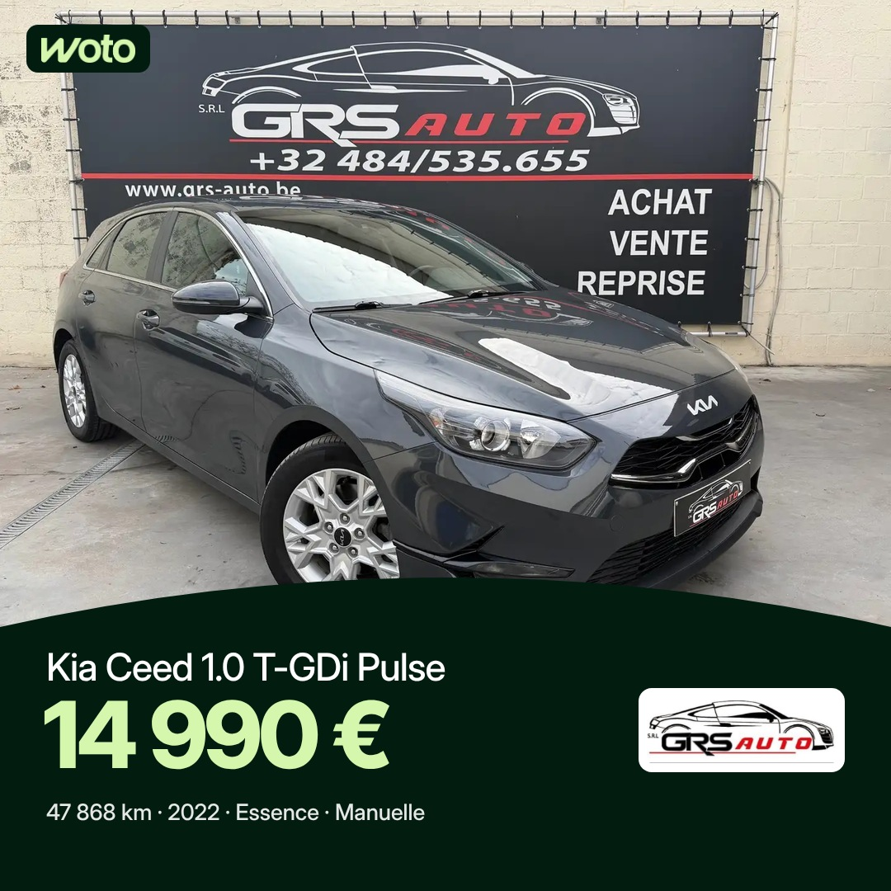
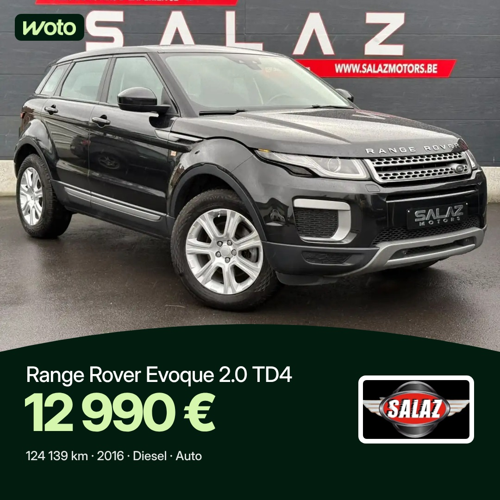
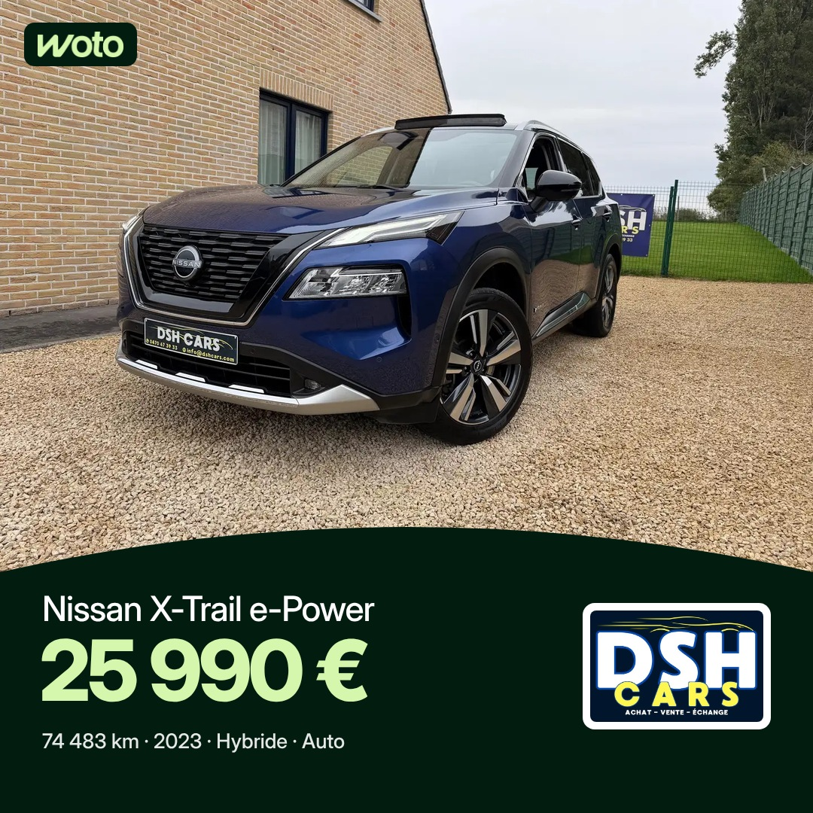
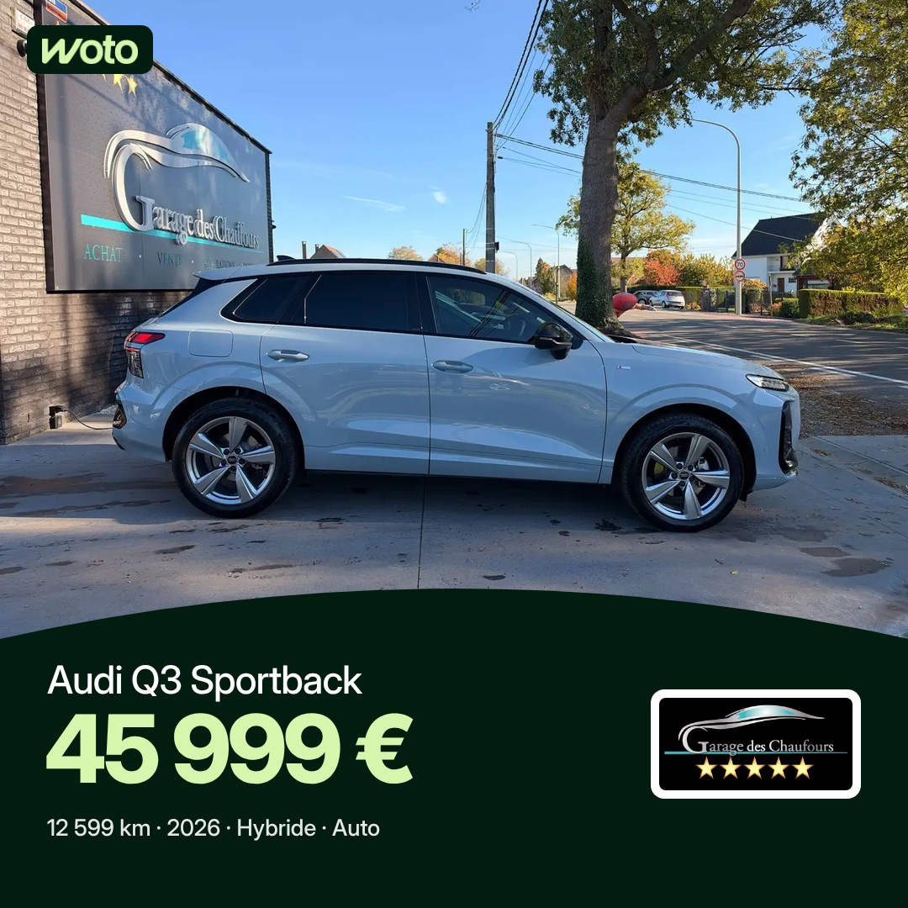
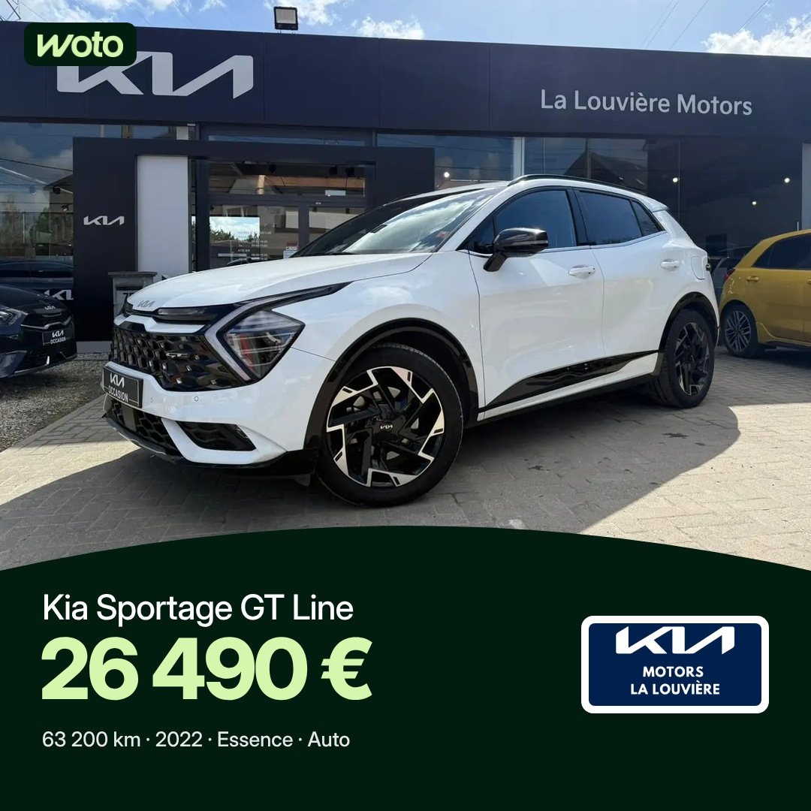
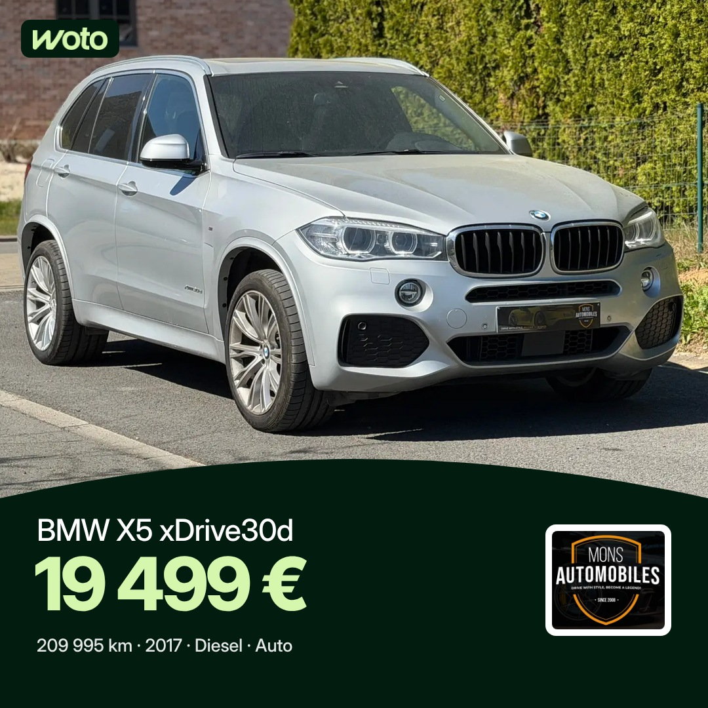
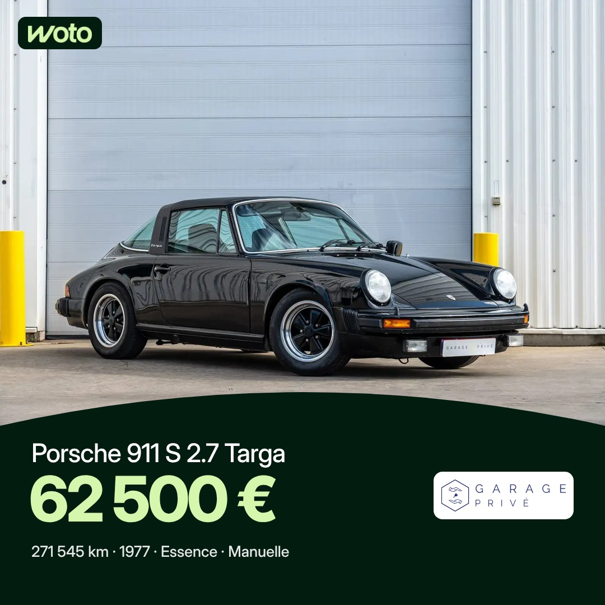
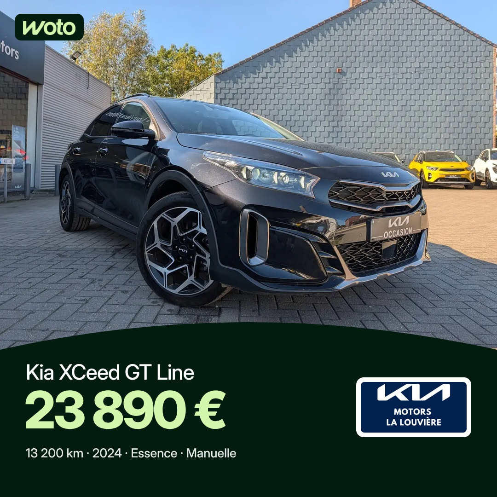

# Projet 2 : publications annonces Woto (fil Facebook et Instagram)

Séparé du projet 1 (stories, voir README.md). Heures de Bruxelles : 7h30, 12h15, 17h00, 19h30 et 21h30, programmées 48 h à l'avance. Règles : [RULES-POSTS.md](RULES-POSTS.md).
Facebook 1080 × 1080, Instagram 1080 × 1350. Premier commentaire posté à 7h35 (avec @followers sur Facebook), 12h35, 17h35, 19h35 et 21h35.

## Vendredi 27 novembre

7h30 (Renault Twingo 1.2, MC Cars) et 12h15 (Toyota Aygo X 1.0, Wattiez Motors) sortis. Restent :

| 17h | 19h30 | 21h30 |
|---|---|---|
|  |  |  |
| Kia Ceed 1.0 T-GDi Pulse, Grs Auto (14 990 €) | Range Rover Evoque 2.0 TD4, Salaz Motors (12 990 €) | Nissan X-Trail e-Power, DSH Cars (25 990 €) |

## Samedi 28 novembre

| 7h30 | 12h15 | 17h | 19h30 | 21h30 |
|---|---|---|---|---|
|  |  |  |  |  |
| Audi Q3 Sportback 1.5 TFSI S line, Garage des Chaufours (45 999 €) | Kia Sportage 1.6 T-GDi GT Line, Kia - La Louvière Motors (26 490 €) | Maserati Levante GranSport, BCS Franzese (49 990 €, boucle) | Mercedes-Benz CLA 200, SabanAuto Quaregnon (20 990 €) | BMW X5 xDrive30d Pack M, Mons Automobiles (19 499 €) |

## Dimanche 29 novembre

| 7h30 | 12h15 | 17h | 19h30 | 21h30 |
|---|---|---|---|---|
|  |  |  |  |  |
| Mercedes-Benz GLE 350 de Coupé 4MATIC, Ryan Khemir (85 900 €) | Porsche 911 S 2.7 Targa, Garage Privé Wavre (62 500 €) | Kia XCeed 1.0 T-GDi GT Line, Kia - La Louvière Motors (23 890 €) | Škoda Scala 1.0 TSI Ambition, Salaz Motors (14 990 €) | Mercedes-Benz C 200 d AMG Line, Garage des Chaufours (38 999 €) |
