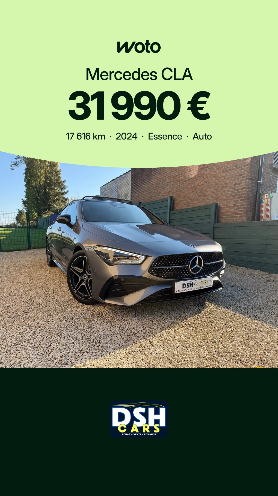
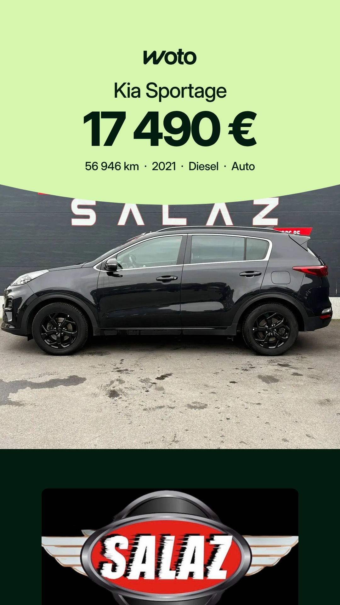
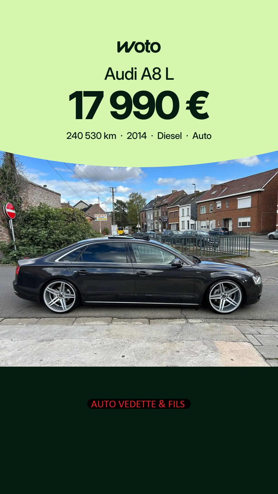

# Planning des stories Woto

Mis à jour chaque matin. Heures de Bruxelles. Sur chaque story, Facebook et Instagram : bouton « Voir l'annonce → ».

## Dimanche 15 novembre

| 7h30 (publiée) | 16h | 20h |
|---|---|---|
|  |  |  |
| Mercedes CLA, DSH Cars | Kia Sportage, Salaz Motors ⚠️ annonce passée « vendue » sur le site | Audi A8 L, Auto Vedette & Fils |

## Lundi 16 novembre

| 7h30 | 16h | 20h |
|---|---|---|
|  |  |  |
| BMW 116d, PP Auto (nouveau garage) ⚠️ même voiture que la publication fil du 17/11 7h30 | Audi A3, Luxury Cars Center By Alfonso | Kia Sportage GT Line AWD, Kia - La Louvière Motors |

Règles : [RULES.md](RULES.md)
