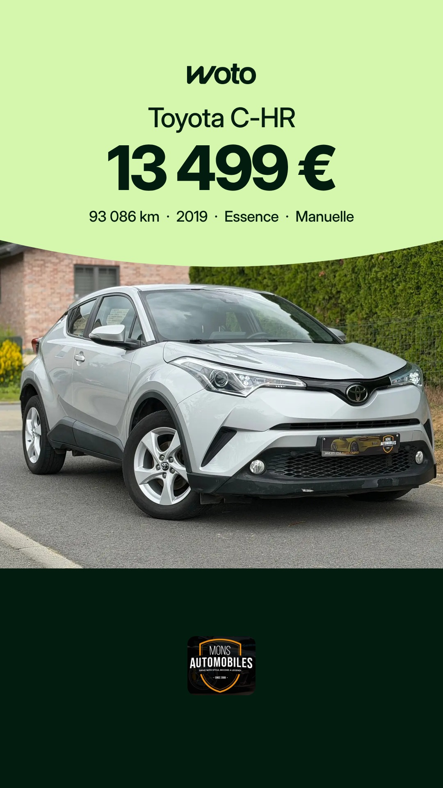
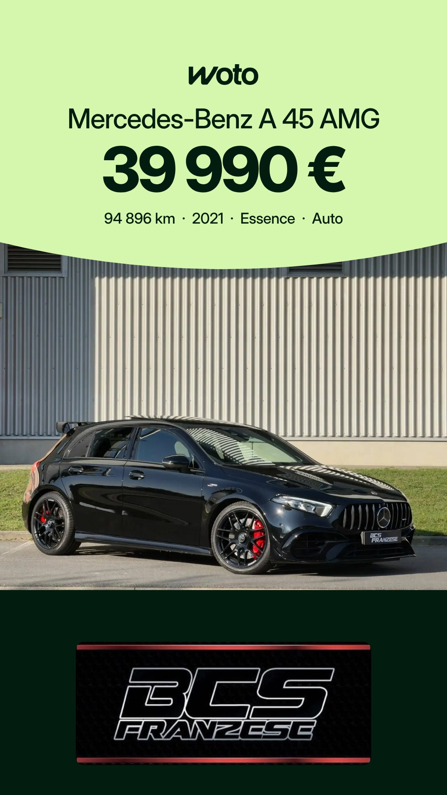

# Planning des stories Woto

Mis à jour chaque matin. Heures de Bruxelles. Sur chaque story, Facebook et Instagram : bouton « Voir l'annonce → ».

## Jeudi 19 novembre

7h30 publiée (Audi A5 Sportback, Salaz Motors), confirmée dans l'agenda Meta.

| 16h | 20h |
|---|---|
|  |  |
| Ford Focus, DSH Cars | Renault Twingo, PP Auto |

## Vendredi 20 novembre

| 7h30 | 16h | 20h |
|---|---|---|
|  |  |  |
| Toyota C-HR, Mons Automobiles | Volkswagen Golf Sportsvan, Wattiez Motors | Mercedes-Benz A 45 AMG, BCS Franzese |

Règles : [RULES.md](RULES.md)
